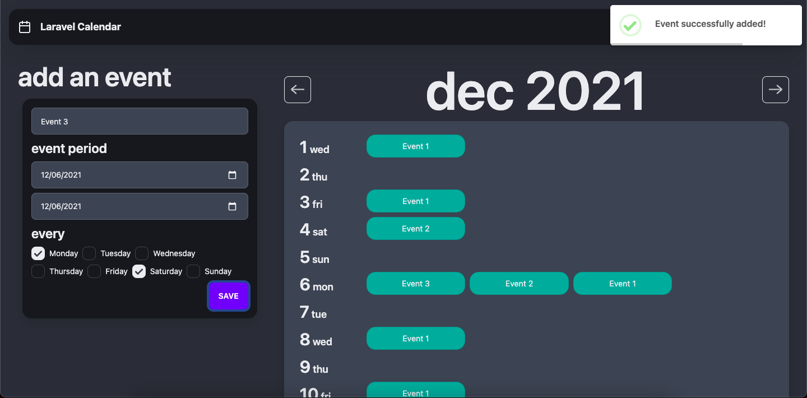
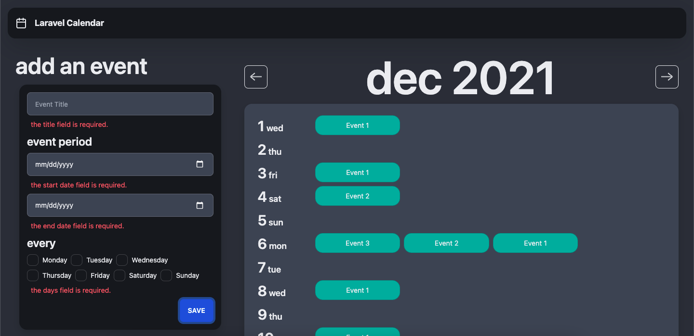
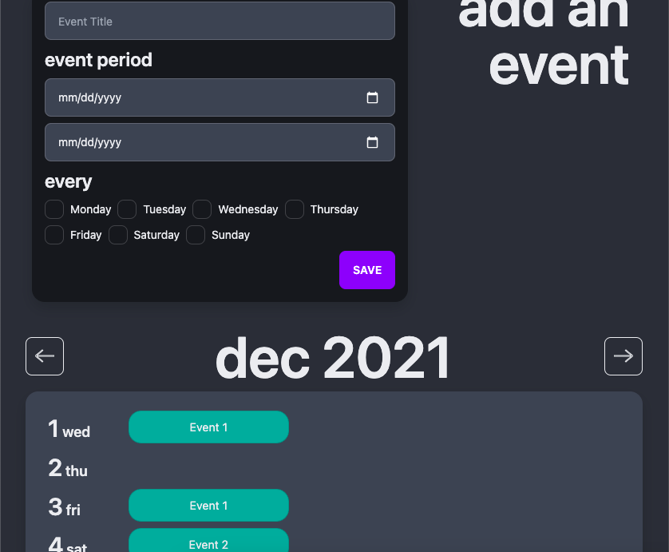

# Laravel Calendar
A simple web app that can add events to a calendar.

## Project Details
- **Backend:** Laravel/PHP
- **Frontend:** Vue.js
- **Packages:**
    - composer
        - laravel/ui
    - npm
        - @tailwindcss/typography
        - daisyui
        - jquery
        - sweetalert2
        - vue-axios
        - vue-router

## Installation
- Create a copy of `.env.example` and set up project's `.env`
- Run `composer install` to install php dependencies
- Run `npm install` to install js packages

- In `resources/js/routes.js` file, change `baseURL` to path of project folder

    Example:
    ```
        // Project directory is http://localhost:8888/laravel-calendar/public
        export const baseURL = "/laravel-calendar/public"; 
    ```

- Run `npm run dev` or `npm run prod` depending on your environment
- Run `php artisan migrate`

## Screenshots



